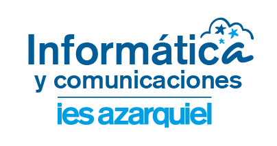

# **SOS - Sostenibilidad Aplicada al Sistema Productivo**

Estos son los apuntes de **SOS (Sostenibilidad Aplicada al Sistema Productivo)**, una asignatura perteneciente al ciclo **ASIR** (Técnico Superior en Administración de Sistemas Informáticos en Redes). En este curso aprenderás sobre la sostenibilidad en los sistemas productivos, con un enfoque en el desarrollo sostenible y la responsabilidad social.

## **Bienvenida al curso**

¡Bienvenidos al módulo de **Sostenibilidad Aplicada al Sistema Productivo**! En este curso abordaremos los principios y prácticas de la sostenibilidad en entornos empresariales y productivos. Aprenderás sobre las normativas, los Objetivos de Desarrollo Sostenible (ODS), y las prácticas responsables que permiten a las empresas minimizar su impacto ambiental y social.

Te invito a que revises la **[Programación Didáctica](#)** del curso, donde encontrarás información detallada sobre las unidades de trabajo, actividades, y objetivos que desarrollaremos durante el curso.

## **Evaluación del curso**

La evaluación de este módulo se basa en un proceso continuo, con una combinación de actividades prácticas, exámenes teóricos y la participación activa en la elaboración de preguntas para los exámenes. A continuación te explico los elementos claves de la evaluación:

### **1. Documentación de trabajo**
Al inicio de cada unidad, deberás crear un documento en **Google Docs** para registrar las actividades propuestas y desarrollarlas. Será obligatorio completar todas las actividades al finalizar la unidad para poder realizar el examen correspondiente.

### **2. Ejercicios colaborativos**
Al final de cada unidad, se te asignarán ejercicios en un **Google Docs colaborativo**, donde trabajarás en grupos para resolver problemas y retos. Esto fomentará la retroalimentación y discusión en clase, fortaleciendo tus conocimientos en sostenibilidad aplicada.

### **3. Creación de preguntas para el examen**
Tú y tus compañeros seréis responsables de elaborar **3algunas preguntas tipo test** por cada parte del temario asignada, que se utilizarán para el examen teórico final de cada unidad. Esta actividad te ayudará a consolidar los conceptos clave del curso y te preparará para la evaluación.

### **4. Práctica Global**
Al finalizar cada unidad, realizarás una **práctica global** que será evaluada individualmente mediante una rúbrica. Esta práctica te permitirá aplicar los conocimientos adquiridos y será un requisito indispensable para la aprobación del curso.

### **5. Examen final**
El examen final de cada unidad estará compuesto por una serie de preguntas de opción múltiple de la siguiente manera:

#### Parte 1: Teoría (100% del examen final)
- Examen tipo **test**, compuesto por preguntas elaboradas por los propios estudiantes.
- Las preguntas incorrectas restarán puntos según la fórmula:  
  **Nota final = Respuestas correctas - (Respuestas Incorrectas ÷ 3)**

## **Evaluación de las Unidades de Trabajo (UT)**

A continuación se muestra la programación didáctica con los porcentajes correspondientes a cada Unidad de Trabajo (UT), así como el trimestre en el que serán evaluadas. Cada unidad tendrá un **30% correspondiente a prácticas y actividades** y un **70% al examen teórico** basado en preguntas tipo test creadas por los estudiantes.

| **Unidad de Trabajo (UT)**                                         | **Trimestre de Evaluación** | **Porcentaje Total (%)** | **Evaluación**                           |
|-------------------------------------------------------------------|-----------------------------|--------------------------|------------------------------------------|
| **UT1. La sostenibilidad y sus retos**              | Primer Trimestre             | 100%                     | 30% Prácticas y actividades, 70% Examen teórico |
| **UT2. Las metas de la sostenibilidad: los ODS**                   | Primer Trimestre             | 100%                     | 30% Prácticas y actividades, 70% Examen teórico |
| **UT3. Empresa y medio ambiente: Los aspectos ASG**  | Segundo Trimestre            | 100%                     | 30% Prácticas y actividades, 70% Examen teórico |
| **UT4. Diseño y producción sostenibles**                         | Segundo Trimestre            | 100%                     | 30% Prácticas y actividades, 70% Examen teórico |
| **UT5. Midiendo la sostenibilidad**                                   | Tercer Trimestre             | 100%                     | 30% Prácticas y actividades, 70% Examen teórico |
| **UT6. El plan de sostenibilidad y otros documentos**                            | Tercer Trimestre             | 100%                     | 30% Prácticas y actividades, 70% Examen teórico |

¡Te deseo mucho éxito en este curso y te animo a participar activamente en todas las actividades propuestas!

<!-- ## **Estructura del curso**
En este curso, trabajaremos en diferentes unidades que te ayudarán a desarrollar tus habilidades en redes de comunicación.

###[Unidad 1. - La sostenibilidad y sus retos:](unidad1/unidad1.md)
###[Unidad 2. - Las metas de la sostenibilidad: los ODS](unidad2/unidad2.md) -->

Haz clic en las secciones anteriores para comenzar a aprender más sobre redes de comunicación.

<a property="dct:title" rel="cc:attributionURL" href="https://github.com/kdeveloper7">PAR</a> by <a rel="cc:attributionURL dct:creator" property="cc:attributionName" href=https://github.com/kdeveloper7>Juan Camilo Lotero Gonzales</a> is licensed under <a href="https://creativecommons.org/licenses/by-nc-sa/4.0/?ref=chooser-v1" target="_blank" rel="license noopener noreferrer" style="display:inline-block;">CC BY-NC-SA 4.0</a>

